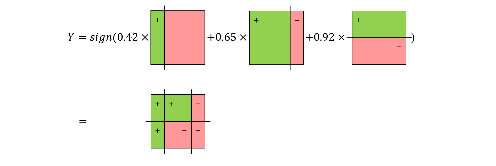

<h2 align="center">AdaBoost</h2>

**AdaBoost**是Adaptive Boosting（自适应提升）的缩写，是一种集成学习方法，由Yoav Freund和Robert Schapire提出，其核心思想是针对同一个训练集训练不同的分类器（弱分类器），然后把这些弱分类器集合起来，构成一个更强的最终分类器（强分类器）。Adaboost算法本身是通过改变数据分布来实现的，它根据每次训练集之中每个样本的分类是否正确，以及上次的总体分类的准确率，来确定每个样本的权值。将修改过权值的新数据集送给下层分类器进行训练，最后将每次得到的分类器最后融合起来，作为最后的决策分类器。

#### 基本原理

**训练：**AdaBoost的每一轮中迭代都会训练并保存一个弱分类器，直到达到设定的迭代次数或者足够小的错误率。在AdaBoost算法中每一个训练样本都会被赋予一个权重。如果某个样本点被错误分类，那么它的权重就得到提高，在下一轮迭代中，弱分类器就能将重点放在上一轮分类错误、权重更大的样本上，并尽量使其分类正确。每一轮训练弱分类器的权重都根据带权误差计算出来，带权分类误差更小的弱分类器将拥有更大的权重。

**预测：**对各分类器输出进行带权，其符号表示了二分类的类别，我们可以使用三个一阶分类器的输出来说明这一过程，假设三个分类权重为 $[0.42,0.65,0.92]$，则针对三个分类器所有可能的输出，有

```matlab
sign(0.42 x +1 + 0.65 x +1 + 0.92 x +1) = sign( 1.99) = +1
sign(0.42 x +1 + 0.65 x +1 + 0.92 x -1) = sign( 0.15) = +1
sign(0.42 x +1 + 0.65 x -1 + 0.92 x +1) = sign( 0.69) = +1
sign(0.42 x +1 + 0.65 x -1 + 0.92 x -1) = sign(-1.15) = -1
sign(0.42 x -1 + 0.65 x +1 + 0.92 x +1) = sign( 1.15) = +1
sign(0.42 x -1 + 0.65 x +1 + 0.92 x -1) = sign(-0.69) = -1
sign(0.42 x -1 + 0.65 x -1 + 0.92 x +1) = sign(-0.15) = -1
sign(0.42 x -1 + 0.65 x -1 + 0.92 x -1) = sign(-1.99) = -1
```

将这个过程可视化：



可以看出，将几个线性弱分类器进行组合就可以得到非线性的分类边界。

#### 算法过程

**输入：**训练样本集 $T = \{(x_1,y_1),(x_2,y_2),\cdots,(x_N,y_N)\}$，其中 $x_i \in \mathbb{R}^n$，$y_i \in \{+1,-1\}$；

**输出：**分类器 $G(x)$

1. 初始化样本集权重：
    $$
    W_1 = (w_{11},w_{12},\cdots,w_{1N}), w_{1i} = \frac{1}{N},i = 1,2,\cdots,N
    $$

2. 对 $m = 1,2,\cdots,M$

    - 使用带权训练集训练基本分类器 

        $G_m(x):\mathbb{R}^n \to \{-1,+1\}$

    -  计算 $G_m$的带权分类误差：

    $$
    e_m = \sum^N_{i=1}w_{mi} I(G_m(x_i) \neq y_i)
    $$
    - 计算 $G_m$的权重：
    $$
    \alpha_m = \frac{1}{2}\log\frac{1-e_m}{e_m}
    $$
    - 更新训练数据集权重：
    $$
    W_{m+1} = (w_{m+1,1}, w_{m+1,2}, \cdots, w_{m+1,N})
    $$
    $$
    w_{m+1,i} = \frac{w_{mi}}{Z_m} \exp \left( {-\alpha_m y_i G_m(x_i)} \right),i=1,2,\cdots,N
    $$
    ​				其中 $Z_m$为规范化因子，用于保证 $\sum^N_{i=1}w_{m+1,i}=1$，故：
    $$
    Z_m = \sum^N_{i=1}w_{mi} \exp \left({-\alpha_m y_i G_m(x_i)} \right)
    $$

3. 构建基本分类器的组合：
    $$
    f(x) = \sum^N_{m=1}\alpha_m G_m(x)
    $$

最终得到分类器：

$$
G(x)=sign(f(x))=sign(\sum^N_{m=1}\alpha_m G_m(x))
$$

#### 算法实现

1. 首先实现一个弱分类器，在这里采用一阶决策树实现，一阶决策树的部分实现如下：

```python
class WeakEstimator:  # 弱分类器, 一阶决策树
	...

    def fit(self, X: np.ndarray, Y: np.ndarray, weights: np.ndarray):
        error = float('inf')  # 最小带权误差
        for feature, x in enumerate(X.T):
            for threshold in np.arange(np.min(x) - self.lr, np.max(x) + self.lr, self.lr):
                for sign in [1, -1]:
                    e = np.sum(weights[np.where(x > threshold, sign, -sign) != Y])  # 取分类错误的样本权重求和
                    if e < error:
                        self.feature, self.threshold, self.sign, error = feature, threshold, sign, e
        return error

    def __call__(self, X: np.ndarray):
        return np.where(X[:, self.feature] > self.threshold, self.sign, -self.sign)

```

​		一阶决策树的训练过程其实就是寻找能使带权分类误差最小的划分特征、划分阈值以及符号。

2. 实现了一阶决策树之后，再通过AdaBoost将多个一阶决策树组合起来，这里的实现过程基本与算法描述一致，不同点在于当分类误差达到下限 $\epsilon$ 时，会提起结束迭代：

```python
class AdaBoost:
	...

    def fit(self, X: np.ndarray, Y: np.ndarray):
        weights = np.full([len(X)], 1 / len(X))  # 样本权重
        for _ in range(self.n_estimators):
            estimator = WeakEstimator(lr=self.lr)
            error = estimator.fit(X, Y, weights)  # 带权重训练弱分类器
            if error < self.eps:  # 误差达到下限，提前停止迭代
                break
            alpha = np.log((1 - error) / error) / 2  # 更新弱分类器权重
            weights *= np.exp(-alpha * Y * estimator(X))  # 更新样本权重
            weights /= np.sum(weights)  # 除以规范化因子
            self.estimators += [(alpha, estimator)]  # 添加此弱分类器

    def __call__(self, X: np.ndarray):
        pred = sum((alpha * estimator(X) for alpha, estimator in self.estimators))
        return np.where(pred > 0, 1, -1)
```

完整的实现代码开源在：[GitHub](https://github.com/luokn/ml/blob/master/AdaBoost/adaboost.py)

#### 实验验证

首先加载数据集：

```python
def load_data():
    x = np.stack([
        np.random.randn(500, 2) + np.array([2, 0]),
        np.random.randn(500, 2) + np.array([0, 2])
    ])
    y = np.stack([np.full([500], -1), np.full([500], 1)])
    return x, y

x, y = load_data()
```

将数据集可视化：

```python
plt.figure(figsize=[12, 6])
plt.subplot(1, 2, 1)
plt.title('Real')
plt.scatter(x[0, :, 0], x[0, :, 1], color='r', marker='.')
plt.scatter(x[1, :, 0], x[1, :, 1], color='g', marker='.')
```

利用AdaBoost进行分类：

```python
x, y = x.reshape(-1, 2), y.flatten()
adaboost = AdaBoost(50)
adaboost.fit(x, y)
pred = adaboost(x)
acc = np.sum(pred == y) / len(pred)
print(f'Accuracy = {100 * acc:.2f}%')
```

将分类结果可视化：

```python
x0, x1 = x[pred == -1], x[pred == 1]
plt.subplot(1, 2, 2)
plt.title('Pred')
plt.scatter(x0[:, 0], x0[:, 1], color='r', marker='.')
plt.scatter(x1[:, 0], x1[:, 1], color='g', marker='.')
plt.show()
```

使用一阶决策树只能获得81.31%的准确率，而使用AdaBoost将多个一阶决策树组合起来精度可以达到93.60%，最终效果如下：


